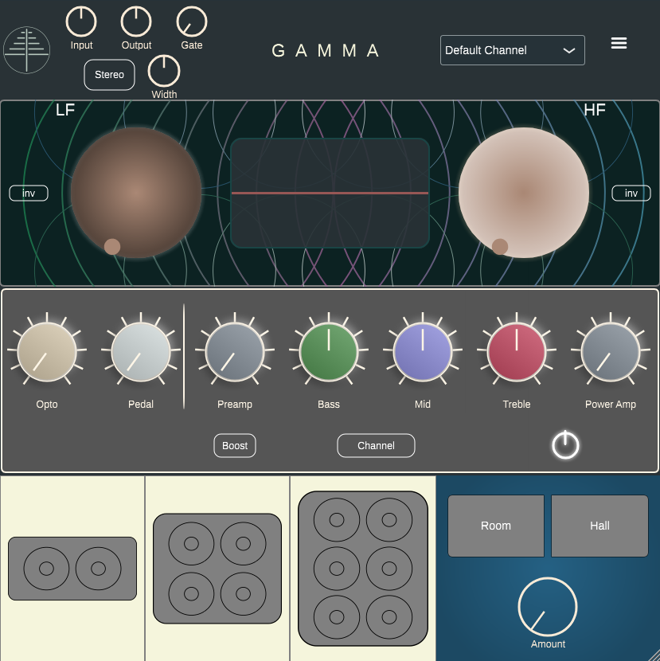
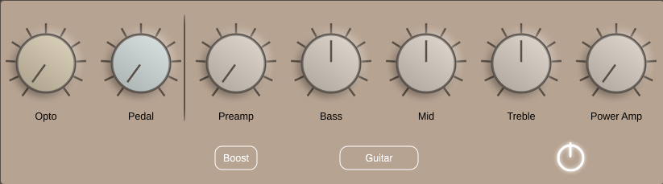
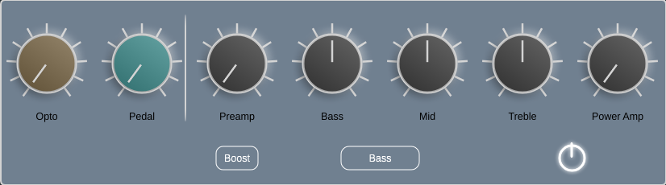
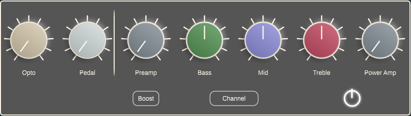
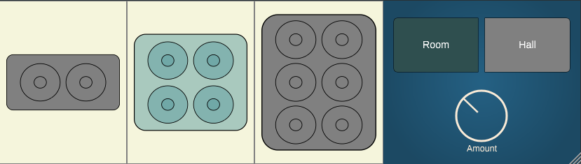
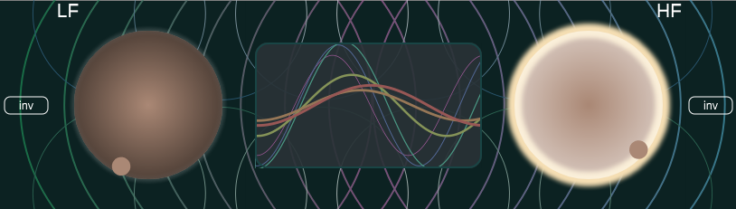

# Gamma

## The Everything Amp

Gamma is a robust, boundary-pushing audio tool meant to be used on any type of sound source. With its full feature set, this can be the only plugin in your signal chain.

Gamma was designed to take the layout of a guitar amplifier and port it to a universal context, with some added features to keep you contained in one interface for the bulk of your mixing.

## Modes

Central to Gamma are its three modes:

### I. Guitar

A classically-voiced guitar amp with a modest, clean-to-crunch default channel, and a more aggressive and bright Boost channel. The guitar mode in Gamma was designed with indie, jazz, or moderate rock tones in mind.

### II. Bass

A robust bass amp that's rather clean by default, but gets pretty crunchy with Boost turned on. The tone stack is voiced to scoop a fair amount of mids and pushes the top end a bit to highlight the picking.

### III. Channel

The catch-all mode that can be used on anything. Functioning like a channel strip, its tone controls are neutrally-voiced at 12 o'clock, and its saturation stages are bypassed at 0, so you're only doing the processing that you need.

Each mode has custom-made settings for most of the effects, calibrated to sound best for each mode.

## Amp Controls

### Opto

An opto-style compressor, and Gamma's namesake (the Greek character 𝜸 or "gamma" is commonly used as a coefficient to denote photons), inspired by but in no way modelled after one of the earlier Boss compressor pedals.

All you *really* need to know is that the higher the knob goes = more compression. At 0 it's fully bypassed.

In the vein of opto compressors, the attack and release times are highly dependent on the signal and the amount of gain reduction being applied. Essentially, with small amounts of gain reduction, the attack and release are slower, with the attack being as high as 50ms, and the release approaching 1 second. With greater amounts of gain reduction, the attack time increases and so does the release, up to 5ms and 50ms respectively.

This results in a very colorful compression, and it's also frequency-dependent. The sidechain is calibrated based on the mode, but with the general pattern of gently filtering the low- and high-end. For the sake of simplicity, just know that the sidechains have been tailored to sound good for whichever mode you're using.

Lastly, in Guitar or Bass mode, the compressor imparts a high-midrange boost to aid in the plucky, punchy effect the compression gives.

### Pedal

This *is* modelled after a classic distortion pedal (it's not the Tube Screamer, don't you have enough of those?) It's the MXR Distortion+ (I'll remove this when they sue me for putting that in here).

Conveniently, the real-life pedal just has one knob to control the distortion, and an output volume knob, so we rolled those together into one knob for a quick and easy distortion pedal before the amp. At 0 this is fully bypassed.

### Preamp and Boost

The preamp stage of the amp, or a series of triodes if you're using Channel mode. By default it will add a nice warmth and crunch in all modes, but by enabling **Boost** you can get some gnarly, tube-flavored distortion.

In Channel mode, this is bypassed at 0.

By Alt/Option-clicking, you can enable automatic gain compensation for just the preamp stage.

### Tone Controls

A mostly self-explanitory set of controls if you've ever used or even thought about using a guitar amp. However, in Channel mode they behave more like a channel strip's EQ section with fixed frequency bands. The filters also have a variable Q depending on the gain.

By Alt/Option-clicking, you can enable frequency-dependent automatic gain compensation for the whole tone section.

### Power Amp

An additional gain stage at the end of the amp/channel strip. In the Guitar and Bass modes, this functions like the pentode tubes in the amp's output stage, or like an optional pair of pentodes at the end of your channel strip.

In Channel mode, this is bypassed at 0.

By Alt/Option-clicking, you can enable automatic gain compensation for just the power amp stage.

## Cabs and Reverb

What amp plugin would be complete without cab simulation? And you're going to need reverb, too.

### Cabs

There are three cabs to choose from:

- **2x12:** A small two-speaker cabinet with a tight, bright, and punchy sound, good for clean guitar or more moderate tones

- **4x12:** A four-speaker cabinet designed for roaring rock tones, with a beefy low-end and a scooped midrange

- **6x12:** Intended to be used as a bass cabinet, this has a huge low-end and a top-end voicing that sounds great on bass guitar

Don't be afraid to try these cabs out in a variety of different situations!

### Reverbs

There are two algorithmic reverbs:

- **Room:** A medium-sized, dampened room with short reflections, great for adding a touch of ambience or space to a sound without it getting overwhelming.

- **Hall:** A longer, richer reverb, perfect for creating a grander scope for your sound

Each of these algorithms are downsampled and therefore a bit lo-fi sounding!

## Enhancers & the Audio Prism™

### Low Frequency Enhancer

On the top left is a Low Frequency Enhancer. It's a saturating low-end boost that works wonders in thickening your sound. The frequency of the boost depends on the mode being used:

- **Guitar:** 300Hz

- **Bass:** 175Hz

- **Channel:** 200Hz

### Invert

Inverts the enhancer's signal for a change in response. This will generally function like a more resonant highpass filter, but due to the nonlinear nature of the enhancer, at higher levels its response can end up looking more like a peak boost around the filter's center.

### High Frequency Enhancer

On the top right is a High Frequency Enhancer. This is a saturating high-end boost, perfect for adding air, presence, or a nice top-end sheen to your sound. The cutoff for the filter is at 7500Hz

### Invert

Inverts the enhancer's signal for a change in response. This will generally function like a more resonant lowpass filter, which can end up functioning like a differently-voiced high-shelf at higher levels.

### Audio Prism™

Imagine if you were able to beam your sound through a prism and see the different light refractions. This is kinda like that.

What it *really* is is a simplified, frequency-weighted waveform display of the outgoing audio.

## Top Controls

1. **Input:** An input gain before all processing, between -12dB and +12dB, useful for adding or decresing headroom before doing non-linear processing. Works just like a clean boost pedal for guitar, too.

2. **Output:** An output gain after all processing, between -12dB and +12dB, for fine-tuning the final level.

3. **Gate:** A simple noise gate before everything else (including the input gain). Threshold ranges from -95dB to -20dB

4. **Stereo | M/S:** Controls the channel format going into the processing. In Stereo mode, left and right will be processed as you would expect. In M/S (Mid/Side) mode, the incoming channels are encoded into Mid/Side and then processed as so. Mid/Side is a method of splitting a stereo signal by what is in the center -- otherwise known as the mono component or the Mid channel -- and the sides -- otherwise known as the Side channel. This can have an interesting spatial effect when the middle and sides of the stereo image are processed independently. For material with most of its energy or loud transients in the center, such as drums or a vocal group, this can lead to a perceived widening of the stereo image. You can further tune this effect with the next control:

5. **Width:** Boosts the width of the stereo signal. This happens *before* the rest of the processing, so it can function like a threshold control for how the sides of your signal will be compressed and saturated.

*Note:* The Stereo | M/S and Width controls won't have any effect if you are only inputting one channel of audio into Gamma.

## Menu

In the upper right is a collapsible menu for maintaining some of Gamma's more advanced features:

- **OpenGL On/Off:** On Windows and Linux, this controls whether hardware-accelerated graphics rendering is done via OpenGL or software rendering. If you've got a decent graphics card in your computer, this may make the UI snappier. Otherwise, if you don't have a graphics card or OpenGL installed on your system, enabling this will either do nothing or cause issues.

- **HQ:** Enables 4x oversampling with minimum-phase filters. On by default

- **Render HQ:** This will enable 4x oversampling when rendering. If HQ is too CPU-intensive for your computer, you could use this to keep aliasing out of your final mix, while getting better performance when mixing in real-time.

- **Comp Stereo Link:** A stereo linking control for the compressor's sidechain.

- If that's gibberish to you, basically what that means is that if this is on, the compressor will process both channels, whether that's left & right, or Mid & Side, in a dependent fashion, where gain reduction on one channel will also apply gain reduction to the other channel. With this off, the channels will compress independent of each other. If linked compression is sounding overbearing, try turning this off.

- **Comp Pos:** This governs the position of the compressor in the signal chain. **Pre** will place it before the amp, and **Post** will place at after the amp, and before the enhancers, cab and reverb sections.

- **Default UI Size:** This will reset the UI size to its default of 800x800

- **Check update:** Checks for an update to Gamma. If there is one, you'll be presented with a list of new changes and asked if you want to download the update.

## Acknowledgements

This plugin would not have been possible without the research and open-source contributions of the following:

- Jatin Chowdhury | https://github.com/Chowdhury-DSP/chowdsp_wdf (c) 2022, Chowdhury-DSP 1| https://chowdsp.com/

- Sam Schachter | https://github.com/schachtersam32/WaveDigitalFilters_Sharc

- xsimd | https://github.com/xtensor-stack/xsimd (c) 2016, Johan Mabille, Sylvain Corlay, Wolf Vollprecht and Martin Renou
  (c) 2016, QuantStack
  (c) 2018, Serge Guelton 1

- Roland Rabien | https://github.com/FigBug/Gin (c) 2018, Roland Rabien 1

- JUCE | https://github.com/juce-framework/JUCE | [juce.com](https://juce.com)

- Alexandre Bique and Paul Walker | [Free Audio/CLAP](https://github.com/free-audio) (c) 2021 Alexandre BIQUE
  (c) 2019-2020, Paul Walker 2

### 1 BSD-3-Clause License

Redistribution and use in source and binary forms, with or without modification, are permitted provided that the following conditions are met:

1. Redistributions of source code must retain the above copyright notice, this
   list of conditions and the following disclaimer.

2. Redistributions in binary form must reproduce the above copyright notice,
   this list of conditions and the following disclaimer in the documentation
   and/or other materials provided with the distribution.

3. Neither the name of the copyright holder nor the names of its
   contributors may be used to endorse or promote products derived from
   this software without specific prior written permission.

THIS SOFTWARE IS PROVIDED BY THE COPYRIGHT HOLDERS AND CONTRIBUTORS "AS IS"
AND ANY EXPRESS OR IMPLIED WARRANTIES, INCLUDING, BUT NOT LIMITED TO, THE
IMPLIED WARRANTIES OF MERCHANTABILITY AND FITNESS FOR A PARTICULAR PURPOSE ARE
DISCLAIMED. IN NO EVENT SHALL THE COPYRIGHT HOLDER OR CONTRIBUTORS BE LIABLE
FOR ANY DIRECT, INDIRECT, INCIDENTAL, SPECIAL, EXEMPLARY, OR CONSEQUENTIAL
DAMAGES (INCLUDING, BUT NOT LIMITED TO, PROCUREMENT OF SUBSTITUTE GOODS OR
SERVICES; LOSS OF USE, DATA, OR PROFITS; OR BUSINESS INTERRUPTION) HOWEVER
CAUSED AND ON ANY THEORY OF LIABILITY, WHETHER IN CONTRACT, STRICT LIABILITY,
OR TORT (INCLUDING NEGLIGENCE OR OTHERWISE) ARISING IN ANY WAY OUT OF THE USE
OF THIS SOFTWARE, EVEN IF ADVISED OF THE POSSIBILITY OF SUCH DAMAGE.

### 2 MIT License

Permission is hereby granted, free of charge, to any 
person obtaining a copy of this software and associated documentation 
files (the "Software"), to deal in the Software without restriction, 
including without limitation the rights to use, copy, modify, merge, 
publish, distribute, sublicense, and/or sell copies of the Software, and
 to permit persons to whom the Software is furnished to do so, subject 
to the following conditions:

The above copyright notice and this permission notice shall be included in all copies or substantial portions of the Software.

THE SOFTWARE IS PROVIDED "AS IS", WITHOUT WARRANTY OF ANY 
KIND, EXPRESS OR IMPLIED, INCLUDING BUT NOT LIMITED TO THE WARRANTIES OF
 MERCHANTABILITY, FITNESS FOR A PARTICULAR PURPOSE AND NONINFRINGEMENT. 
IN NO EVENT SHALL THE AUTHORS OR COPYRIGHT HOLDERS BE LIABLE FOR ANY 
CLAIM, DAMAGES OR OTHER LIABILITY, WHETHER IN AN ACTION OF CONTRACT, 
TORT OR OTHERWISE, ARISING FROM, OUT OF OR IN CONNECTION WITH THE 
SOFTWARE OR THE USE OR OTHER DEALINGS IN THE SOFTWARE.
